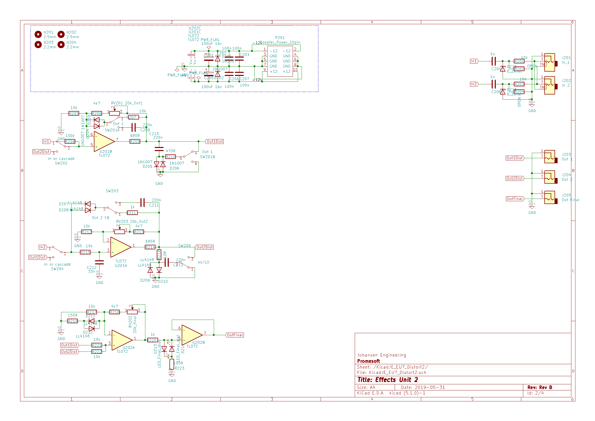
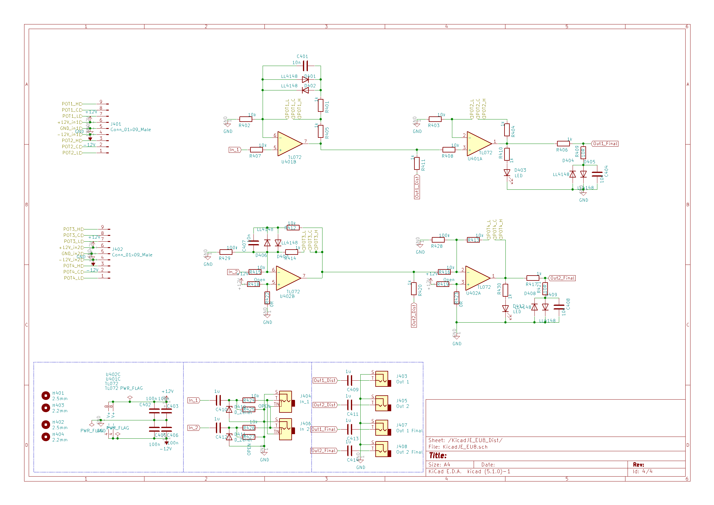

# KicadJE_EffectsUnit2
Distortion test base

# Purpose
Use for Distortion Effects unit and Distortion pedal

# Status - Preliminary SCH/PCB In the mail
## Initial 
| Stage  | Detail | Status |
| ------------- | ------------- | ------------- |
| create material  | sch/pcb | OK  |
| | gerber | OK |
| production  |   | Initiated |
|  | produced | Pending |
|  | delivered |  |
## Preliminary validation
| Test  | Detail | Status |
| ------------- | ------------- | ------------- |
| Initial Inspection | |  |
| Initial Technical Test |  |  |
| Initial Product Test |   |  |
| Initial Product Test |   |  |

## Secondary validation
| Test  | Detail | Status |
| ------------- | ------------- |------------- |
| Product Test |  | |
| Product Test |  |  |
| Quality | | |
| Quality | | |
| Long Term Product Test |  |  |
| Power Draw |  | 

## Errata
### Errata -

## Issues and Notes
### 

# Pictures

# Other components

![]
